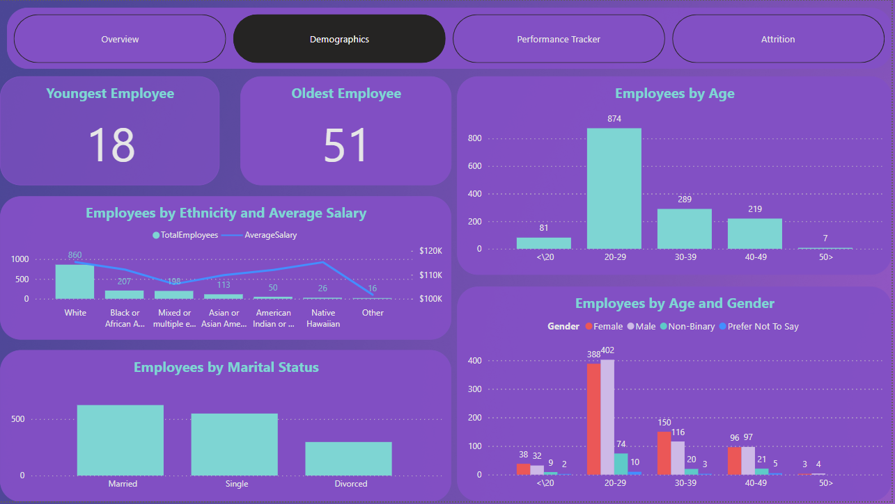

# PowerBI-PeoplePuls
The project for HR-department completed in PowerBI

PeoplePulse (name changed) is a mid-sized U.S.-based software technology company. The company builds enterprise software solutions for clients across various industries, with a strong focus on innovation, agile development, and user-centric design.
As part of a freelance collaboration, I conducted an in-depth HR analytics project using internal employee data. The goal was to explore attrition trends, analyze department-level dynamics, and identify actionable insights to improve employee retention and inform strategic workforce planning.

## Repository structure

├── Dataset:

│ ├── Employee.csv

│ ├── EducationLevel.csv

│ ├── PerformanceRating.csv

│ ├── RatingLevel.csv

│ └── SatisfiedLevel.csv
│
├── Visualizations:

│ ├── Attrition.png

│ ├── Demographics.png

│ ├── Overview.png

│ ├── Performance Tracker.png

│ └── PerformanceRating.png

├── Reports:

│ └── TechCompany HR Analysis.pbix

└── README.md

The initial dataset contains 5 tables: 1 fact table ("PerformanceRating") and 4 dimension tables ("EdducationLevel", "Employee", "RatingLevel", "SatisfiedLevel"). 

The fact table content 1470 rows. 

During the data preparation phase, I reviewed and adjusted the data types for all columns to ensure consistency and accuracy. I created a dedicated Measures table to organize all calculated measures used in the visualizations. Additionally, I established the necessary relationships between the tables to enable proper interaction across the report.

### Visualization Overview.

Key Insights:
The company has employed over 1470 employees. 
Currently, the company employs 1233 people. 
The largest department is Technology
The attrition rate 16% - it's a significant level that needs attention from HR department

### Visualization Demographic

Key Insights: 
Most employees are between 20-29 years old
The company employs 2.7% more women than men
Non-binary employees make 8.5% of total employees
Youngest employee is 18 y.o., oldest - 51 y.o.
The average salary of white employees is 4 times higher than the average salary of employees of other races.

### Visualization Performance Tracker

Key Insights: 
Performance Tracker allows to see the satisfaction rate through years by each employee

### Visualization Attrition

Key Insights: 
With overtime attrition rate is 20% higher than without 
There is a correlation between attrition and the years spent with the company: the longer a person is with the company, the less likely they are to be fired.
Two peaks of attrition are observed among employees hired in 2016 and 2020. Perhaps the reason for the weak adaptation of employees in 2016 was the reorganization of the enterprise, and in 2020 - remote work due to the coronavirus.
The attrition rate is significantly higher among employees who frequently travel on business trips (24.9% among travelers and 8% among non-travelers). This means that business trips can be tiring and undesirable, and it is essential to discuss this with employees.
The highest turnover rate is among employees in the Sales and Marketing departments. This may be due to pressure to deliver results or overload.

# Business Recommendations
1. Reduce Overtime Workload
Set overtime limits and monitor for burnout

Offer compensatory time-off or bonuses for extra hours

2. Rethink Travel Policy
Frequent travel correlates with high churn
 → Implement job rotation, hybrid meeting formats, or travel perks

3. Improve New Hire Retention
Introduce:

Mentorship programs

Structured onboarding

Career planning during the first year

4. Optimize Sales & HR Engagement
Sales team needs review of:

Targets, KPIs, and stress levels

Career path opportunities

Motivation and reward systems

5. Scale Tech Department Best Practices
Technology team shows low churn — may benefit from:

Clear growth paths

Good workload balance
 → Replicate these strategies across other departments

